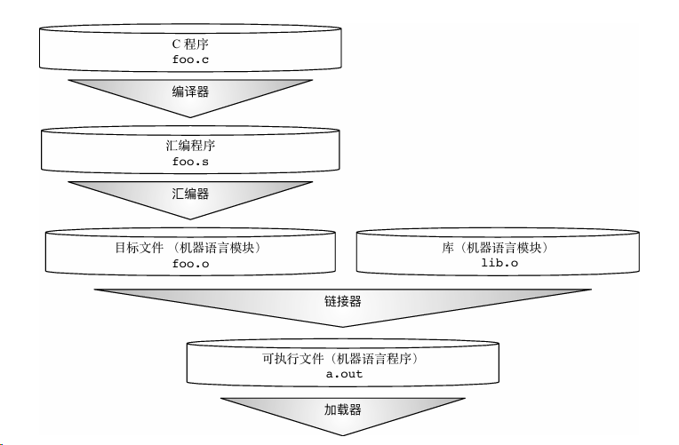

# 1C语言简介

## 1.1关于C语言

* 通用的高级语言。
* 丹尼斯·里奇在贝尔实验室为开发UNIX操作系统而设计。
* 1972 年在 DEC PDP-11 计算机上被首次实现。
* 1978 年布莱恩·柯林汉和丹尼斯·里奇制作了 C 的第一个公开可用的描述，现在被称为 K&R 标准。
* C 语言是以 B 语言为基础的，B 语言大概是在 1970 年被引进的。
* 编程语言排名常年霸榜前3。数据来源：[https://www.tiobe.com/](https://www.tiobe.com/)。

## 1.2C语言主要标准

| 标准                   | 年份 | 说明                                                                                                                              |
| ---------------------- | ---- | --------------------------------------------------------------------------------------------------------------------------------- |
| C90(ISO/IEC 9899:1990) | 1990 | 第一个国际标准，在第一个正式标准C89(ANSI C 1989)改进而来，定义了 C 语言的基本语法和功能，包括数据类型、控制结构、函数和库接口等。 |
| C99(ISO/IEC 9899:1999) | 1999 | 是 C 语言的第二个重要国际标准。支持宽字符、复合字面量、变长数组，还增强了浮点运算的支持，并增加了新的数学函数。                   |
| C11(ISO/IEC 9899:2011) | 2011 | 在 C99 的基础上增加了一些新特性，如线程支持、原子操作、动态内存管理改进等。还定义了一些关于并发编程的新 API。                     |
|                        |      |                                                                                                                                   |

## 1.3C语言常用编译器

| 名称 | 操作系统         | 下载地址                                                                                                          |
| ---- | ---------------- | ----------------------------------------------------------------------------------------------------------------- |
| GCC  | WINDOWS          | [https://github.com/niXman/mingw-builds-binaries/releases](https://github.com/niXman/mingw-builds-binaries/releases) |
|      | MAC OS           | [https://developer.apple.com/xcode/](https://developer.apple.com/xcode/)                                             |
|      | UNIX/Linux(内置) | [https://gcc.gnu.org/install/](https://gcc.gnu.org/install/)                                                         |
| VC   | WINDOWS          | [https://visualstudio.microsoft.com/](https://visualstudio.microsoft.com/)                                           |
|      |                  |                                                                                                                   |

## 1.4C语言编译过程



## Demo1_1

* foo.c

```C
#include <stdio.h>
int main(void)
{
	printf("Hello world!\n");
	return 0;
}
```

* 执行结果

```cmd
gcc hello.c -o hello.exe
```

执行结果

# 2C语言基础语法

## 2.1令牌

令牌是程序的基本组成单位。编译器通过对源代码进行词法分析，将代码分解成一个个的令牌。令牌主要有如下几种类型：

### 2.1.1关键字

| 序号 | 关键字        | 说明                                                          |
| ---- | ------------- | ------------------------------------------------------------- |
| 1    | auto          | 声明自动变量                                                  |
| 2    | break         | 跳出当前循环                                                  |
| 3    | case          | 开关语句分支                                                  |
| 4    | char          | 声明字符型变量或函数返回值类型                                |
| 5    | const         | 定义常量，如果一个变量被 const 修饰，那么它的值就不能再被改变 |
| 6    | continue      | 结束当前循环，开始下一轮循环                                  |
| 7    | default       | 开关语句中的"其它"分支                                        |
| 8    | do            | 循环语句的循环体                                              |
| 9    | double        | 声明双精度浮点型变量或函数返回值类型                          |
| 10   | else          | 条件语句否定分支（与 if 连用）                                |
| 11   | enum          | 声明枚举类型                                                  |
| 12   | extern        | 声明变量或函数是在其它文件或本文件的其他位置定义              |
| 13   | float         | 声明浮点型变量或函数返回值类型                                |
| 14   | for           | 一种循环语句                                                  |
| 15   | goto          | 无条件跳转语句                                                |
| 16   | if            | 条件语句                                                      |
| 17   | int           | 声明整型变量或函数                                            |
| 18   | long          | 声明长整型变量或函数返回值类型                                |
| 19   | register      | 声明寄存器变量                                                |
| 20   | return        | 子程序返回语句（可以带参数，也可不带参数）                    |
| 21   | short         | 声明短整型变量或函数                                          |
| 22   | signed        | 声明有符号类型变量或函数                                      |
| 23   | sizeof        | 计算数据类型或变量长度（即所占字节数）                        |
| 24   | static        | 声明静态变量                                                  |
| 25   | struct        | 声明结构体类型                                                |
| 26   | switch        | 用于开关语句                                                  |
| 27   | typedef       | 用以给数据类型取别名                                          |
| 28   | unsigned      | 声明无符号类型变量或函数                                      |
| 29   | union         | 声明共用体类型                                                |
| 30   | void          | 声明函数无返回值或无参数，声明无类型指针                      |
| 31   | volatile      | 说明变量在程序执行中可被隐含地改变                            |
| 32   | while         | 循环语句的循环条件                                            |
| 33   | inline(C99)   | 声明内联函数                                                  |
| 34   | restrict(C99) | 限定指针是访问对象的唯一且初始方式                            |

### 2.1.2标识符

标识符是程序中变量、函数、数组等的名字。标识符由字母（大写或小写）、数字和下划线组成，但第一个字符必须是字母或下划线，不能是数字。一个标识符以字母 A-Z 或 a-z 或下划线 _ 开始，后跟零个或多个字母、下划线和数字（0-9）。

### 2.1.3常量

常量是固定值，在程序执行期间不会改变。常量可以是整型常量、浮点型常量、字符常量、枚举常量等。

### 2.1.4字符串字面量

字符串字面量是由双引号括起来的字符序列。字符串末尾会自动添加一个空字符 '\0'。

### 2.1.5运算符

运算符用于执行各种操作，如算术运算、逻辑运算、比较运算等。C 语言中的运算符种类繁多，常见的包括：

* 算术运算符 ：`+`, `-`, `*`, `/`, `%`
* 关系运算符 ：`==`, `!=`, `>`, `<`, `>=`, `<=`
* 逻辑运算符 ：`&&`, `||`, `!`
* 位运算符 ：`&`, `|`, `^`, `~`, `<<`, `>>`
* 赋值运算符 ：`=`, `+=`, `-=`, `*=`, `/=`, `%=`
* 其他运算符 ：`sizeof`, `?:`, `&`, `*`, `->`, `.`

### 2.1.6分隔符

分隔符用于分隔语句和表达式，常见的分隔符包括：

* 逗号 ：用于分隔变量声明或函数参数。
* 分号 ：用于结束语句。
* 圆括号 : 用于分组表达式、函数调用。
* 花括号 : 用于定义代码块。
* 方括号 : 用于数组下标。

在 C 程序中，分号是语句结束符，也就是说，每个语句必须以分号结束，它表明一个逻辑实体的结束。

## 2.2基本结构

* 头文件包含
* 宏定义
* 函数声明
* 主函数
* 变量声明
* 语句和表达式
* 控制流语句
* 函数定义
* 返回语句

## 2.3注释

* 单行注释
* 多行注释
*
